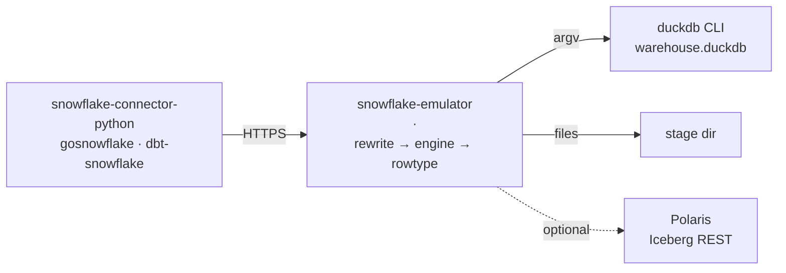

# Architecture

One Go process terminates Snowflake's HTTP surface and hands SQL to a DuckDB
CLI. There is no second service, no queue, and no state a restart cannot
rebuild from the warehouse file.

## The three layers a statement passes

**Rewrite.** Snowflake spellings DuckDB does not have become ones it does:
`DATEDIFF(day, a, b)` → `date_diff('day', a, b)`, `LATERAL FLATTEN` → `unnest`
over `json_extract`, `v:path::type` → `json_extract_string`, `TABLE(GENERATOR
(ROWCOUNT => n))` → a range. Scalar functions are DuckDB **macros** rather
than pattern substitutions, because a regex looking for a call's closing paren
gets it wrong on exactly the expressions worth having — `NVL(IFF(1=0,1,NULL),7)`
and `NVL('a,b','z')` both work here for that reason.

Rewrites run only over code. A quote inside a `--` comment is prose, not the
start of a string — a lesson from a real model, where `Friday's` in a comment
header silently disabled every rewrite below it for the rest of the statement.

**Engine.** The CLI runs the statement and prints JSON. Its **exit code is not
trusted**: v1.2.2 exits 0 after refusing, so stderr is the signal. Numbers keep
their digits (`UseNumber`, not float64), NULL stays null rather than becoming
the string `<nil>`, and column order is the order DuckDB printed — it used to
be Go map iteration order, which is randomised, so one query returned four
different column orders across twelve identical requests.

**Rowtype.** DuckDB's column types become Snowflake's, because a client
converts values **by type**: `DECIMAL(19,4)` → `fixed` with precision 19 and
scale 4, not `text`. `DESCRIBE` supplies the type for describable statements,
since duckdb prints a DECIMAL and a VARCHAR alike as JSON strings and only the
catalog can tell them apart.

## What is deliberately absent

No metadata database, no query history, no result cache, no warehouse
scheduler. A warehouse is a handle with a state; `SUSPEND` is refused as a
query target and nothing else changes. Anything not implemented is refused by
name rather than approximated — see [parity](parity.md).
